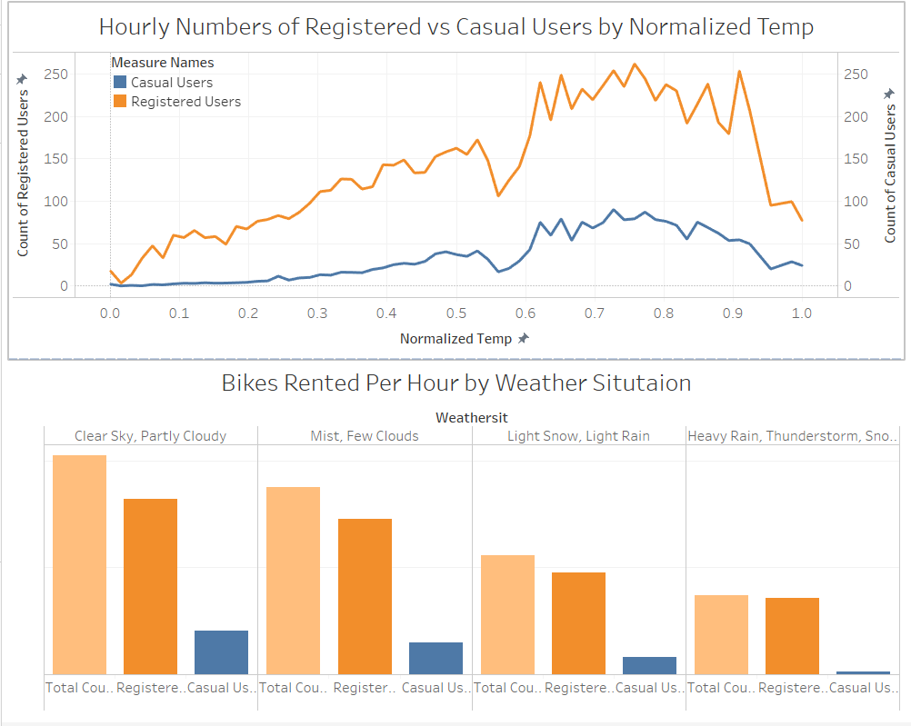

# BikeSharingAnalysis
Bike sharing service analysis is a project based on the data that is gathered form the bike service based out in Washington. Apart from interesting real-world applications of bike sharing systems, the characteristics of data being generated by these systems make them attractive for the research. In this project, there were two objectives,
1. The environmental factors which affect the bike hiring count per day the most.
2. Forecasting the bike hiring count per day.

A tableau report is also created to resolve following research questions:
•	Effects of weather on the bike sharing count.
•	Environmental factors affecting the bike sharing count.
•	Bikes rented by week, day and hour
•	Most popular rental hours.

The entire analysis has been visualized in the form of several Dashboards and have incorporated in a story.

### Install

This project requires **R and RStudio** installed:

Make sure you have [R](https://www.r-project.org/) installed.

Also install [RStudio](https://rstudio.com/) which is an IDE for R. 

### Run

In a terminal or command window, run the following window to run the R file

```bash
r -f <filename.r>
```  
or you can open the file in RStudio and run it from the software or run the above command in RStudio terminal.

## Results 
Effects of weather on the bike sharing count:



Forecasting the bike hiring count:


## Contributing
Pull requests are welcome. For major changes, please open an issue first to discuss what you would like to change.

Please make sure to update tests as appropriate.
